# Self Diagnostic App

> Blueprint generated by [BeforeBuild](https://beforebuild.com)

## Overview

Self diagnostic app

## Architecture

```mermaid
flowchart TD
    mobile-application["Mobile Application<br/>React Native"]
    backend-api-gateway("Backend API Gateway<br/>AWS API Gateway")
    authentication-service("Authentication Service<br/>Serverless Functions")
    diagnostic-engine-service("Diagnostic Engine Service<br/>Serverless Functions")
    user-database[("User Database<br/>AWS RDS (PostgreSQL)")]
    content-database[("Content Database<br/>AWS RDS (PostgreSQL)")]
    content-management-system("Content Management System<br/>Contentful")
    web-application["Web Application<br/>Next.js with TypeScript"]
    analytics-service("Analytics Service<br/>Segment")
    notification-service("Notification Service<br/>Serverless Functions")
    payment-processing-service("Payment Processing Service<br/>Serverless Functions")
    file-storage-service{{"File Storage Service<br/>AWS S3"}}
    static-asset-storage{{"Static Asset Storage<br/>AWS S3"}}
    content-delivery-network{{"Content Delivery Network<br/>AWS CloudFront"}}

    backend-api-gateway -->|"Authenticates requests"| authentication-service
    backend-api-gateway -->|"Initiates diagnosis"| diagnostic-engine-service
    authentication-service -->|"Stores/Retrieves user data"| user-database
    diagnostic-engine-service -->|"Stores diagnostic history"| user-database
    diagnostic-engine-service -->|"Fetches diagnostic content"| content-database
    content-management-system -->|"Manages content"| content-database
    mobile-application -->|"Sends telemetry"| analytics-service
    web-application -->|"Sends telemetry"| analytics-service
    backend-api-gateway -->|"Logs API usage"| analytics-service
    backend-api-gateway -->|"Triggers notifications"| notification-service
    diagnostic-engine-service -->|"Sends diagnosis updates"| notification-service
    backend-api-gateway -->|"Initiates payments"| payment-processing-service
    payment-processing-service -->|"Stores purchase data"| user-database
    payment-processing-service -->|"Sends purchase alerts"| notification-service
    diagnostic-engine-service -->|"Stores/Retrieves files"| file-storage-service
    content-management-system -->|"Stores content assets"| file-storage-service
    backend-api-gateway -->|"Manages direct uploads"| file-storage-service
    content-delivery-network -->|"Caches assets from"| static-asset-storage
    web-application -->|"Fetches static assets from"| content-delivery-network
    mobile-application -->|"Fetches static content from"| content-delivery-network
    mobile-application -->|"Makes API calls via"| content-delivery-network
    web-application -->|"Makes API calls via"| content-delivery-network
    content-delivery-network -->|"Routes API requests to"| backend-api-gateway
```

## Components

| Component | Description | Priority |
|-----------|-------------|----------|
| Mobile Application | The native mobile application interface for users to access the diagnostic tool. | **Core** |
| Backend API Gateway | Entry point for all external requests, routing them to appropriate serverless functions. | **Core** |
| Authentication Service | Manages user authentication, authorization, and user profiles. | **Core** |
| Diagnostic Engine Service | Processes diagnostic queries, applies logic, and generates results based on user input and content. | **Core** |
| User Database | Stores user accounts, preferences, diagnostic history, and purchase records. | **Core** |
| Content Database | Houses all diagnostic content, questions, algorithms, and related media assets. | **Core** |
| Content Management System | Allows content creators to manage and publish diagnostic content and assets. | Recommended |
| Web Application | The web-based interface for users to access the diagnostic application. | Recommended |
| Analytics Service | Collects and processes user behavior and application performance data for insights. | Recommended |
| Notification Service | Handles sending various notifications to users via email, SMS, or push notifications. | Recommended |
| Payment Processing Service | Manages secure processing of user payments and subscriptions. | **Core** |
| File Storage Service | Stores user-submitted files and static assets used by the application. | Recommended |
| Static Asset Storage | Stores static files like frontend build artifacts, images, and other publicly accessible assets. | Recommended |
| Content Delivery Network | Distributes static assets and caches API responses closer to users for improved performance and reliability. | Recommended |

## Builder Pack

This repository includes a complete Builder Pack with AI-generated documentation:

- [RUNBOOK.md](./.beforebuild/RUNBOOK.md) — Step-by-step setup and deployment guide
- [ARCHITECTURE.md](./.beforebuild/ARCHITECTURE.md) — System design, data flow, and component relationships
- [PROMPTS.md](./.beforebuild/PROMPTS.md) — AI prompts for building each component
- [LIMITS.md](./.beforebuild/LIMITS.md) — Known limitations and what is not production-ready
- [TESTPLAN.md](./.beforebuild/TESTPLAN.md) — Testing strategy and acceptance criteria

---

*Built with [BeforeBuild](https://beforebuild.com) — the trust layer between AI code and production.*
